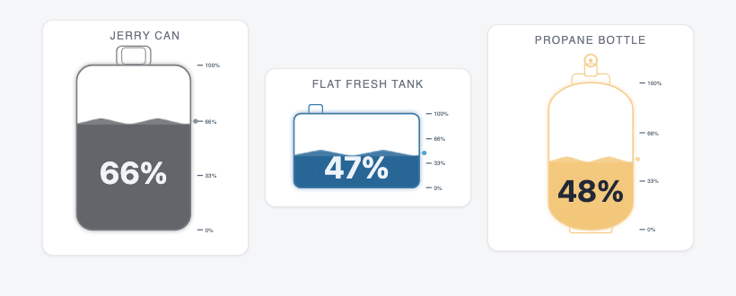
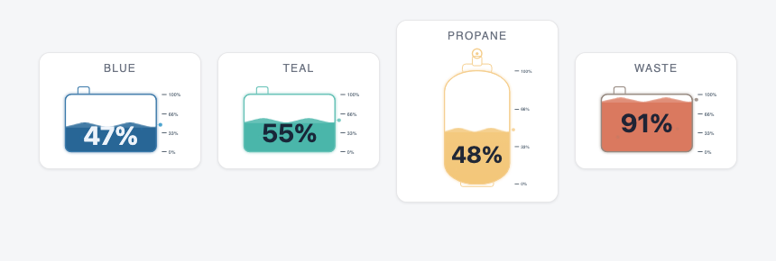
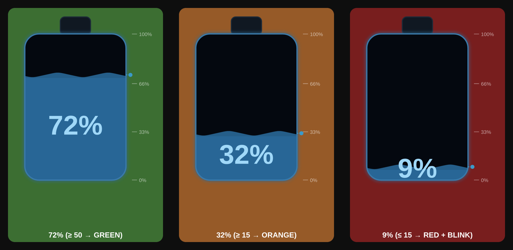
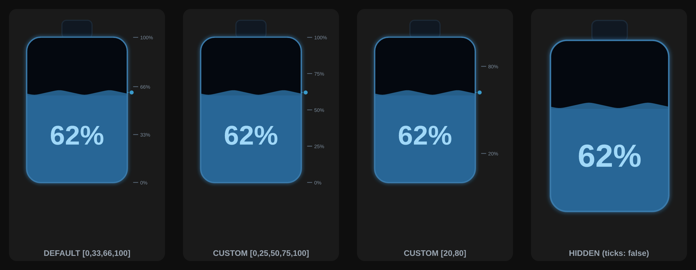
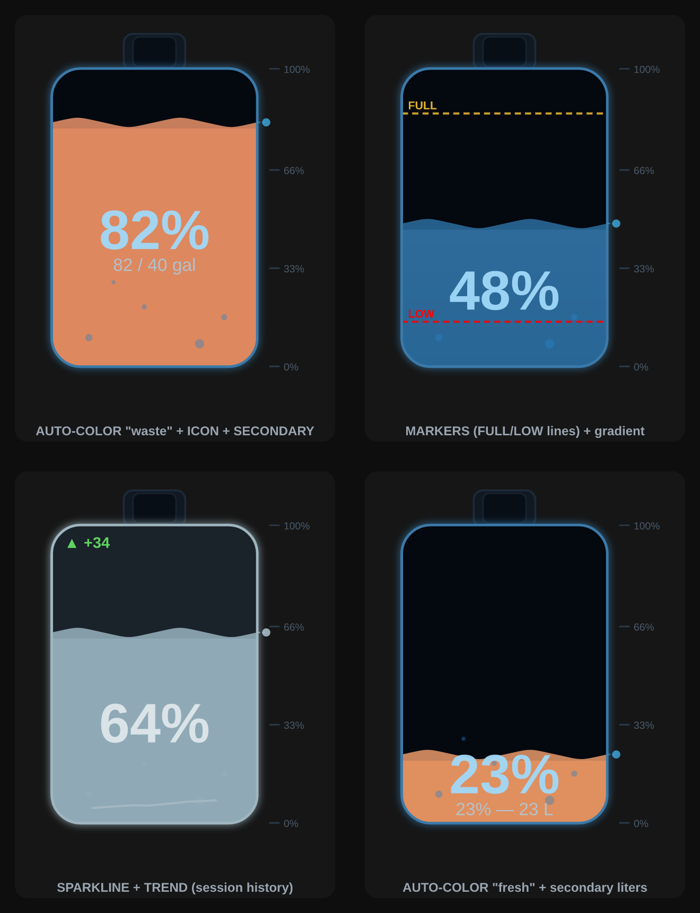
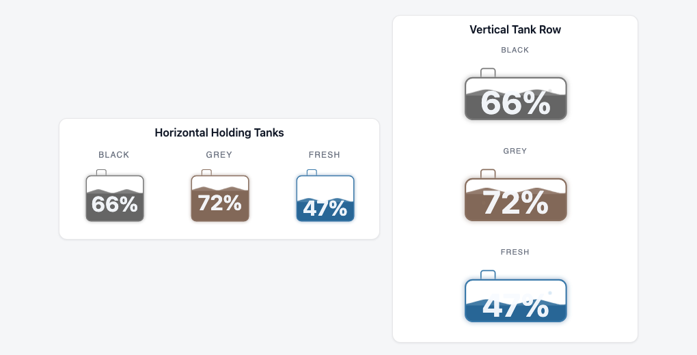
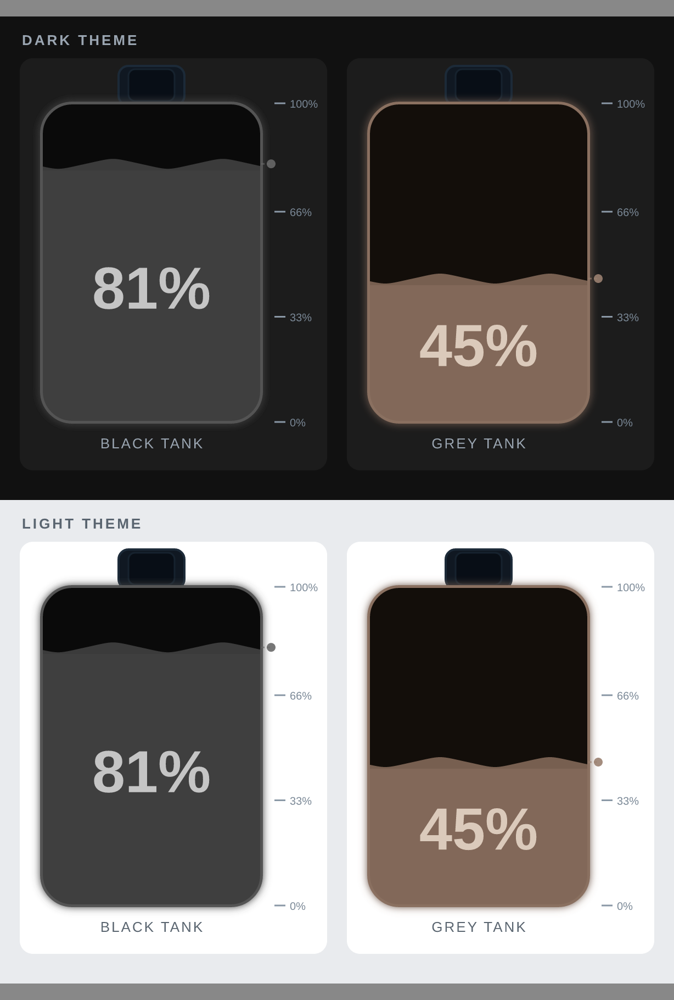

# RV Tank Level Cards for Home Assistant

Animated, highly configurable tank-level cards for Home Assistant Lovelace
dashboards — built for RV black / grey / fresh water and propane tanks, but
useful for any 0–100 level sensor.



Two custom cards are included:

- **`rv-tank-level-card`** — a single animated tank gauge
- **`rv-tank-row-card`** — several tanks side by side in one card

> Screenshots are static; in Home Assistant the liquid waves, bubbles rise, and
> the level animates as your sensor changes.

## Features

- Animated liquid wave, rising bubbles, and smooth fill transitions
- Three tank shapes: `default` (jerry-can), `propane` cylinder, and a
  `rectangular`/flat tank with configurable width & height
- Any CSS color for the liquid (named / hex / rgb) or fine-grained `colors:`
  overrides — plus optional `gradient`
- `auto_color`: automatic green → amber → red by level (`fresh` or `waste`)
- Value-driven styling (card-mod `state:` compatible): recolor the card
  background **and/or the liquid**, with `blink` support
- `card_background` accepts `transparent` or any CSS color/background value;
  the empty tank interior follows it unless `colors.tank_bg` is set
- Tank caps/fittings follow the tank background and border colors
- Propane foot-ring decoration is masked behind the tank shell
- Percentage text automatically contrasts against the active liquid color
- Title font size and alignment are configurable; wrapped titles stay aligned
- `tank_scale` shrinks or enlarges tank SVGs inside cramped dashboard blocks
- Configurable or hideable side level markers, with custom labels & colors
- Threshold `markers` drawn across the tank
- `secondary` templated text, `sparkline`, and `trend` arrow
- Home Assistant visual editor support for common options
- Follows your dashboard theme; tap to open the entity's more-info dialog
- Resizes cleanly in Sections (grid) view with compact default grid sizing
- Works cleanly inside `horizontal-stack` without overlapping neighboring cards

## Installation

### HACS (recommended)

1. HACS → ⋮ → **Custom repositories** → add this repo's URL, category **Dashboard**.
2. Install **RV Tank Level Cards**.
3. HACS adds the resource automatically. If you added it manually, use:
   - URL: `/hacsfiles/rv-level-cards/rv-tank-level-card.js`
   - Type: **JavaScript module**

### Manual

1. Copy `dist/rv-tank-level-card.js` to `<config>/www/rv-tank-level-card.js`.
2. Settings → Dashboards → Resources → Add:
   - URL: `/local/rv-tank-level-card.js`
   - Type: **JavaScript module**

## Development

The editable source lives in `src/rv-tank-level-card.js`. The HACS/manual-install
artifacts are generated at `rv-tank-level-card.js` and
`dist/rv-tank-level-card.js`.

```bash
npm run verify
```

Current build behavior intentionally copies `src/rv-tank-level-card.js` to
`dist/rv-tank-level-card.js` without transpilation or bundling. This keeps the
local development setup faithful to the existing card until the source is split
into modules.

The Home Assistant visual editor uses HA's native `ha-form` controls for common
settings. Advanced nested options remain available through the YAML editor and
the editor's Advanced JSON sections.

## Quick start

```yaml
type: custom:rv-tank-level-card
entity: sensor.black_tank_level
name: Black Tank
color_scheme: black
```

See [`examples/dashboard.yaml`](examples/dashboard.yaml) for more, including the
multi-tank card, markers, auto-color, propane, and threshold styling.

## Screenshots

### Tank colors & gradient
Any CSS color drives the whole palette; `colors:` overrides individual parts,
and `gradient: true` adds a glossy top-lit fill.



### Value-driven styling
`state:` rules recolor the card background (and optionally the liquid), with
`blink` support — here green ≥ 50, amber ≥ 15, red ≤ 15.



### Side level markers
Custom levels, per-tick labels and colors, or hidden entirely.



### Markers, secondary text, auto-color, sparkline & trend
Threshold lines across the tank, templated text under the %, automatic
green→amber→red coloring, and an in-session history line / ▲▼ trend arrow.



### Multiple tanks in one card
`rv-tank-row-card` with shared `defaults` and per-tank overrides.
Row-card outer padding and tank gap are configurable.
Row-card orientation can be horizontal or vertical.



### Theme-aware
The card background follows your dashboard theme (dark and light shown).



## Options (`rv-tank-level-card`)

| Option | Default | Description |
|---|---|---|
| `entity` | — | **Required.** Sensor with a 0–100 numeric state. |
| `name` | entity id | Card title. |
| `color_scheme` | `blue` | `black` / `grey` / `blue`, or any CSS color. |
| `colors` | — | Per-key overrides: `fill`, `wave`, `glow`, `border`, `text`, `bubble`, `tank_bg`. `tank_bg` overrides the empty SVG tank interior. |
| `card_background` | theme default | Card, tank-panel, and empty tank background. Use `transparent`, `none`, or any CSS background value such as `rgba(0,0,0,.25)`. |
| `title_font_size` | `.75rem` | Tank title font size. Numbers are treated as px; CSS sizes like `0.8rem` are accepted. |
| `title_align` | `center` | Tank title alignment: `left`, `center`, or `right`. |
| `tank_scale` | `1` | Multiplier for the SVG tank size inside the card. Use values like `0.75` for cramped blocks or `1.25` for larger cards. |
| `gradient` | `false` | Glossy top-lit liquid. |
| `auto_color` | `false` | `true`/`fresh` (high = green) or `waste` (high = red). |
| `shape` | `default` | `default` / `propane` / `rectangular`. |
| `tank_width`, `tank_height`, `tank_radius` | `220`/`150`/`12` | Rectangular shape only (viewBox px). |
| `ticks` | `[0,33,66,100]` | Custom levels; `false`/`[]` to hide. Items may be `{value,label,color}`. |
| `markers` | — | Threshold lines: `{value,label,color,dashed}`. |
| `max_width` | `280` | px cap; `none`/`full` to fill the column. |
| `font_size` | `54` | Percentage text size (viewBox px). |
| `decimals` | `0` | Decimals shown. |
| `value_format` | `{value}%` | Template: `{value}`, `{unit}`, `{state}`, `{name}`, `{attr:NAME}`. |
| `secondary` | — | Templated text under the %. Same placeholders. |
| `icon` | — | Faint glyph/emoji behind the %. |
| `sparkline` | `false` | Mini in-session history line. |
| `trend` | `false` | ▲/▼ change arrow from in-session history. |
| `state` | — | card-mod-style threshold rules (see below). |
| `tap_action` | `more-info` | `more-info` or `none`. |

When `colors.text` is not set, the percentage and secondary text automatically
switch between light/dark text based on the active liquid color. This keeps
`auto_color` and state-driven fill changes readable on both light and dark
themes.

When `colors.tank_bg` is not set, the empty part of the SVG tank and its
cap/fitting follow `card_background`, then the Home Assistant card theme. Set
`colors.tank_bg` when you want the empty tank interior to stay a specific color.

### Value-driven styling (`state`)

First matching rule wins; order from most to least specific. A rule can set the
card `color`/`blink`/`styles` **and/or** recolor the liquid via `fill`/`wave`.

```yaml
state:
  - { value: 50, operator: ">=", color: "rgb(217,255,179)" }
  - { value: 15, operator: ">=", color: "rgb(255,194,153)" }
  - value: 15
    operator: "<="
    color: red
    fill: "#c0392b"   # liquid turns red when low
    blink: true
```

Operators: `>=` `>` `<=` `<` `==` `!=` (default `>=`).

## Options (`rv-tank-row-card`)

| Option | Description |
|---|---|
| `tanks` | **Required.** List of `rv-tank-level-card` configs. |
| `defaults` | Optional config merged under every tank. |
| `title` | Optional card heading. |
| `card_background` | Optional row-card wrapper background; same behavior as `rv-tank-level-card`. |
| `title_font_size` | Optional row-card heading font size. Numbers are treated as px; CSS sizes are accepted. |
| `title_align` | Optional row-card heading alignment: `left`, `center`, or `right`. |
| `orientation` | Row orientation: `horizontal` (default) or `vertical`. |
| `row_padding` | Outer padding around the tank row. Numbers are treated as px; CSS sizes like `0`, `8px`, or `0.5rem` are accepted. |
| `tank_gap` | Gap between tanks. Numbers are treated as px; CSS sizes are accepted. |

Per-tank options such as `tank_scale`, `title_font_size`, and `title_align` can
be set on each item in `tanks` or shared through `defaults`.

In Home Assistant Sections view, new single-tank cards default to a compact
3-4 column footprint depending on shape/ticks, and content stays centered when
the block is resized. Use `tank_scale` and `max_width` together for very small
or very large section blocks.

> **Note on `sparkline`/`trend`:** history is kept in memory for the current
> browser session (it resets on reload). For long-term history use a
> `history-graph` or `mini-graph-card` alongside this one.

## License

[MIT](LICENSE)
